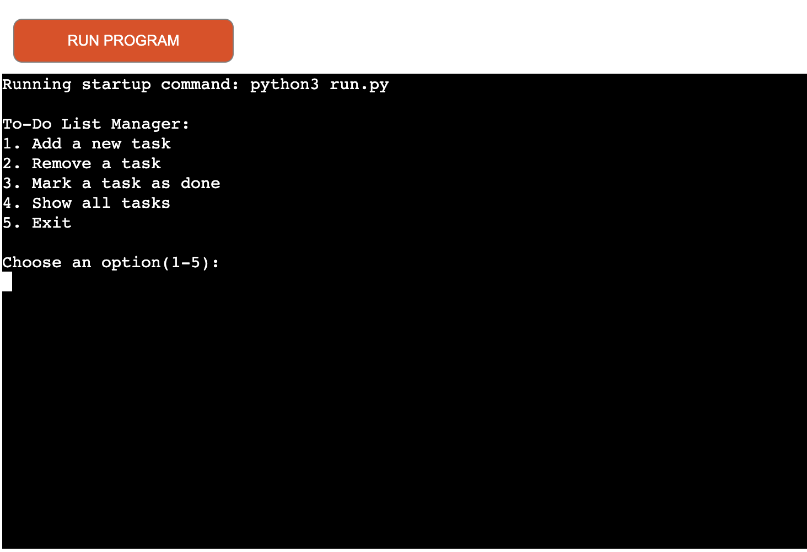

# To-Do List Mannager
[View the live project here](https://to-do-list-manager-8ccfde7e2228.herokuapp.com/)

The To-Do List Manager is a simple command-line based To-Do List application written in Python that helps you manage your tasks efficiently. This program allows you to add, remove, mark tasks as done, and view your task list.

## Target Audience

The tool is designed for individuals, student, and professionals who need a simple yet effective way to manage their personal and work-related tasks. 

## Use Case
A student uses this to-do list manager to keep track of assignments and exam preparations. The tool allows them to add tasks and mark them as complete once they have finalized them, ensuring that no important coursework is overlooked. Additionally, it helps them manage personal commitments and extracurricular activities, ensuring they stay organized and maintain a balanced schedule throughout the semester.

## Rules of the Application

The To-Do-List Manager operates on a straightforward premise:
1. Users cann add tasks to a list, each represented with description and a completion status (Pending or Done)
2. Tasks can be removed from the list by selecting their corresponding index. 
3. Users can mark tasks as complete, updating their status. 
The application continously prompts users until they choose to exit. 

## Features
- Initial instructionns: When starting the application, users receive clear instructions on how to interact with the system.
- Add Task: Users can input task descriptions to add them to their to-do list.
- Remove Task: The current list of tasks displayed, allowing users to choose which task to remove. 
- Mark Task as Done: Users can mark specific tasks as completed. 
- Show All Tasks: View all tasks along with their current status. 
-Exit Option: Users can exit the application when easily when finished. 

## How to use the To-Do List Manager

1. Interact with the Menu:
- A menu will display options for managing your tasks

2. Choose an Option
- Input the number corresponding to your desired action, such as adding or removing tasks. 

3. Error Handling
- The application includes input validation, providing error messages for invalid selections or actions to ensure a smooth user experience.

## Testing

I have tested my Pythonn code through various means:

- PEP8 Validation: The code was validated using PEP8 style guide without any errors. 

- Manual Testing of Functions: Inputs were tested against expected outputs to confirm functionality. 

- Gameplay Testing: The application was run with both normal and edge case inputs to ensure it handles errors appropriately.

## Bugs
Solved Bugs

- Indexing Error when Removing Tasks: Initially, when attempting to remove tasks from the to-do list, I mistakenly deleted the wrong items because I had overlooked that lists in Python are zero-indexed. To fix this, I adjusted the indexing by adding -1 where necessary, ensuring that the correct tasks are removed or marked as done.
- Empty Task Submissions: While testing the "Add Task" functionality, I discovered that the application accepted empty submissions. I addressed this by using the strip() method to check for empty spaces. Now, an error message is displayed when a user attempts to add an empty task.
- Task Description Length Validation: During testing, I found that the application did not enforce a maximum character limit for task descriptions, allowinng users to input excessively long texts. To resolve this issue, I implemented a character limit validation, ensuring that task descriptions do not exceed 80 characters. If a user attempts to enter a longer description, an error message is now displayed, prompting them to revise their input. 

## Deployment
This project was deployed using Code Institute's mock terminal for Heroku.

- Steps for deployment:
    - For or clone this repository 
    - Create a new Heroku app
    - Set the buildblacks to Python and NodeJS in that order
    - Link the Heroku app to the repository
    - Click on Deploy

## Credits
- Code Institute for the deployment terminal and the [Python template](https://github.com/Code-Institute-Org/p3-template).
- The code and idea of the to-do list manager came originally from [Projects Explained](https://www.youtube.com/watch?v=bfHAeWZ7oAY). In addition, the code to to check for empty spaces came from [w3school](https://www.w3schools.com/python/ref_string_strip.asp). However, all the code has been modified to suit the specific needs of this application and it is no longer in its original form.
